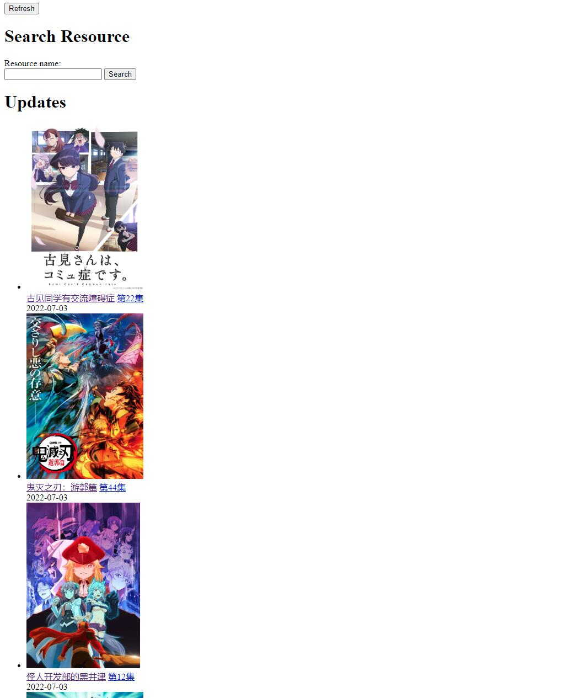

# Automatically Download Anime You Like

This site get torrents from Nyaa.si and BT之家 and download these torrents with aria2c automatically. It should also support other movies and TVs (not guaranteed).

This is intended for personal usage, so the frontend is very poor. Some functions are unstable and it lacks many functions. Improvements are welcomed.

## Installation

Install dependencies

```sh deps.sh```

Import SQL database

```mysql -u username -p < Bangumis.sql```

Change the sql table `Info`, add an entry with the site of BT之家 (not provided, find it in your own way).


Check and change the configuration files: 

```sh
aria.conf       # aria2c config
bangumi.conf    # nginx configuration
bangumi.service # system service file
config.py       # main config
```

The static files (covers and videos) are served by Nginx, modify and put the bangumi.conf to /etc/nginx/site-enabled/ and restart Nginx. If you want a systemd service, put the modified bangumi.service to /etc/systemd/system/.

Start aria2c with rpc:

```sh
aria2c --conf-path=aria.conf --enable-rpc --rpc-listen-all --rpc-allow-origin-all
# or
sh ./aria2c.sh
```

The backend first searches torrents from Nyaa.si, which needs a proxy.

```sh
export http_proxy=http://[user:pwd@]proxy_ip:proxy_port
export https_proxy=http://[user:pwd@]proxy_ip:proxy_port
# or change the bangumi.service file
```

If you don't want to use proxy and Nyaa, comment the branch out in scrapy.py.

Start the website backend

```sh
python main.py
# or if using systemd service
systemctl start bangumi
```

## Usage

Access port 9000 (default configuration). The frontend is very simple and poor.



It shows the bangumis, the latest episode and its update date.

To add a anime, there are two methods. The first method is search it with the "Search Resource" form. After search and select the desired anime,


You can see the torrents that have some episode patterns and single torrents without pattern. The episode numbers that detected by the patterns are shown after the torrent pattern. Try to use a good pattern that covers all the episodes. If some episode is not covered, don't worry. The backend can still try to find the missing episodes. You can also manually add episodes later.

Choose a desired pattern, fill the corresponding textbox (below the pattern text) with the bangumi's name ("相合之物" in this example), then click the choose button next to it. Done. The downloading takes time. You can see the downloading progress in the bangumi's page. The episodes without the progress bar are downloaded.


If some episodes are missing, you can manually add it here.

The second method of adding an anime is in the end of the index page. Fill the three text boxes with the bangumi url in BT之家, torrent pattern and the bangumi's name. This method is not recommended now.

By default, the site fetch the updates every 4 hours. If you want to manually fetch the updates, click the Refresh button at the top of the page. It will find and download the newest episodes. This process takes a lot of time. Therefore, if a bangumi season ended, you should manually change the corresponding sql table entry `ended` in `Bangumi` to 1 (directly change the sql, no UI for now). Then the site will not fetch the episodes for this bangumi.